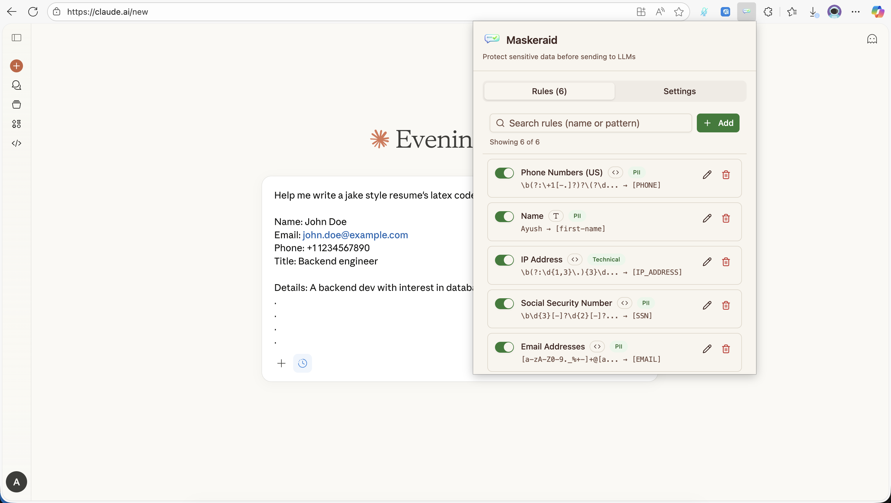
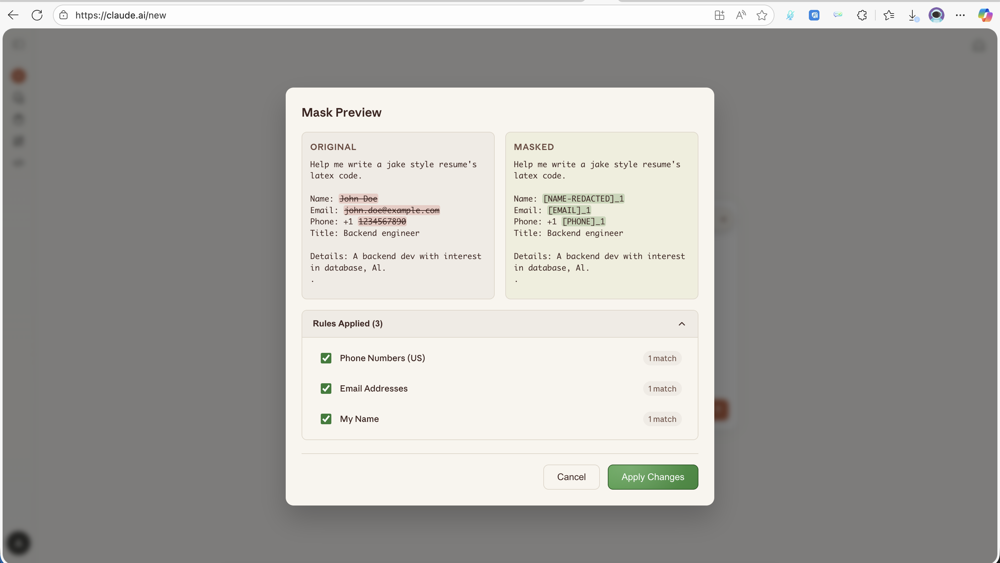
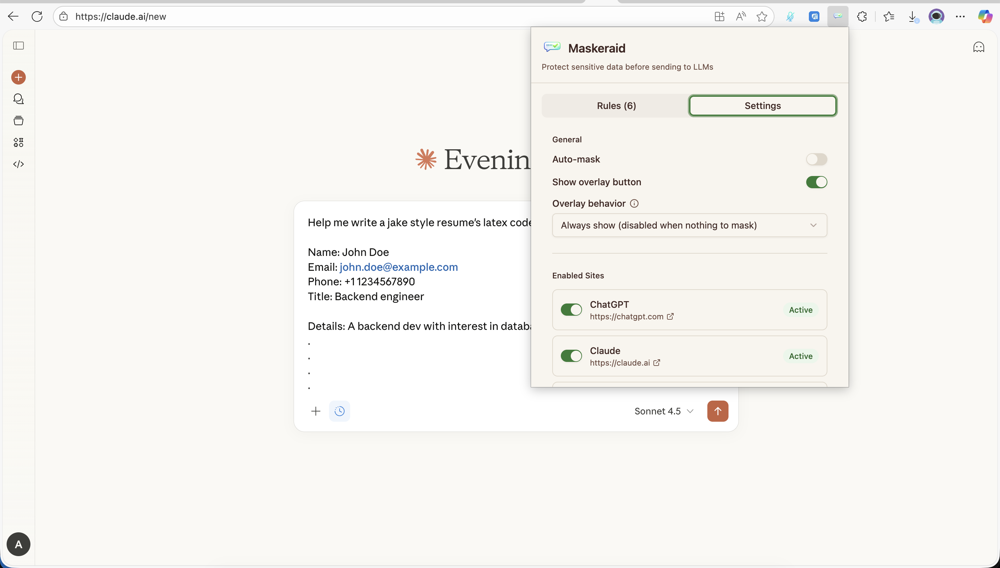
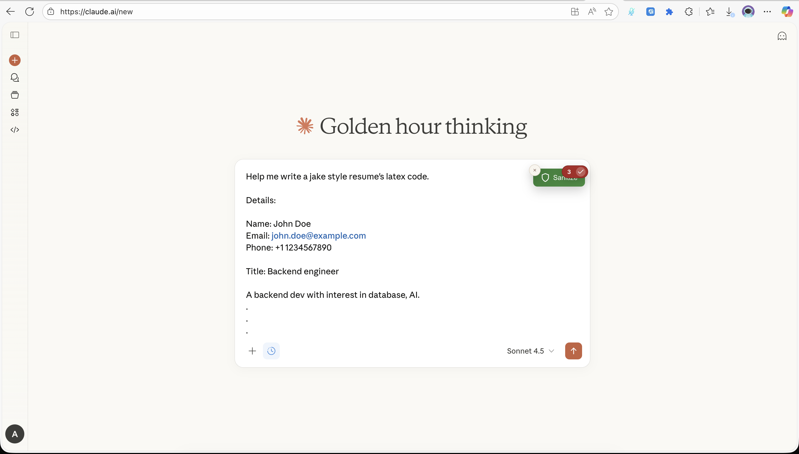

# Maskeraid - LLM Data Mask Extension

A browser extension that automatically sanitizes Personally Identifiable Information (PII) and sensitive data from your prompts before sending them to Large Language Models (LLMs) like ChatGPT, Claude, and Gemini.



## What It Does

Maskeraid protects your privacy by automatically applying custom sanitization rules to mask or replace sensitive information in your prompts. This includes:

- **Email addresses** - Replace with masked versions
- **Phone numbers** - Mask digits while preserving format
- **Credit card numbers** - Replace with safe placeholders
- **SSN/Social Security Numbers** - Mask sensitive digits
- **Custom patterns** - Create your own regex or string replacement rules
- **Real-time preview** - See what will be sent before submitting

The extension works seamlessly on:

- **ChatGPT** ([chat.openai.com](https://chat.openai.com), [chatgpt.com](https://chatgpt.com))
- **Claude** ([claude.ai](https://claude.ai))
- **Gemini** ([gemini.google.com](https://gemini.google.com))
- **Huggingface Chat** ([huggingface.co/chat](https://huggingface.co/chat))

Upcoming support for more LLM platforms!

- **Perplexity AI** ([perplexity.ai](https://perplexity.ai))
- **Microsoft Copilot** ([copilot.microsoft.com](https://copilot.microsoft.com))
- **T3 Chat** ([t3.chat](https://t3.chat))
- **Z AI Chat** ([chat.z.ai](https://chat.z.ai))

and more...

Feel free to raise issues or contribute!



## How to Use

### 1. Install the Extension

1. Clone this repository
2. Build the extension: `npm run build`
3. Open Chrome and navigate to `chrome://extensions/`
4. Enable "Developer mode" (top right)
5. Click "Load unpacked" and select the `dist` folder

### 2. Configure Sanitization Rules

Click the extension icon to open the popup:



- **Rules Tab**: Create, edit, and manage sanitization rules

  - Click "Add Rule" to create a new rule
  - Define pattern (regex or plain text)
  - Set replacement text
  - Enable/disable rules as needed

- **Settings Tab**: Configure extension behavior
  - Enable/disable auto-sanitization
  - Toggle overlay visibility
  - Select which sites to enable
  - Choose theme (light/dark/system)

### 3. Use on LLM Sites

When you visit ChatGPT, Claude, or Gemini:

1. Type your prompt in the text area
2. The extension automatically detects and sanitizes sensitive data
3. A preview overlay shows what will be sent (if enabled)
4. Submit your prompt with confidence



## Tech Stack

- **React 19** - Modern UI framework
- **TypeScript** - Type-safe development
- **Vite** - Fast build tool and dev server
- **Tailwind CSS v4** - Utility-first styling
- **Radix UI** - Accessible component primitives
- **Chrome Extension APIs** - Manifest V3
- **Shadow DOM** - Style isolation for content scripts

### Key Dependencies

- `@radix-ui/*` - Accessible UI components
- `class-variance-authority` - Component variants
- `clsx` & `tailwind-merge` - Class name utilities
- `diff` - Text diffing for preview
- `lucide-react` - Icon library

## Local Development

### Prerequisites

- Node.js 18+ and npm
- Chrome browser

### Setup

```bash
# Install dependencies
npm install

# Start development server with HMR
npm run dev

# Build for production
npm run build

# Type check
npx tsc --noEmit

# Lint code
npm run lint

# Preview production build
npm run preview
```

### Development Workflow

1. **Make changes** to source files in `src/`
2. **Build** the extension: `npm run build`
3. **Reload** the extension in `chrome://extensions/`
4. **Test** on supported LLM sites

### Project Structure

```
src/
├── background/     # Service worker for cross-context communication
├── content/        # Content scripts injected into LLM sites
│   └── sites/      # Site-specific handlers (ChatGPT, Claude, Gemini)
├── popup/          # React popup UI components
├── components/ui/  # Reusable UI components (shadcn/ui pattern)
├── shared/         # Shared utilities, types, storage, sanitizer
└── lib/            # Utility functions
```

### Build Output

The `dist/` folder contains:

- `manifest.json` - Extension manifest
- `background.js` - Service worker
- `content.js` - Content script bundle
- `index.html` & assets - Popup UI
- `icons/` - Extension icons

## Features

- ✅ **Custom Rules** - Create regex or plain text replacement rules
- ✅ **Real-time Preview** - See sanitized text before sending
- ✅ **Multi-site Support** - Works on ChatGPT, Claude, and Gemini
- ✅ **Smart Overlay** - Optional preview overlay with diff highlighting
- ✅ **Rule Management** - Enable/disable, edit, delete rules
- ✅ **Dark Mode** - System-aware theme support
- ✅ **Persistent Storage** - Rules and settings saved locally
- ✅ **Type-safe** - Full TypeScript support

## Credits

- **Name suggestion**: The creative name "Maskeraid" was suggested by [@datarat23](https://github.com/datarat23)

## License

Private project - All rights reserved
